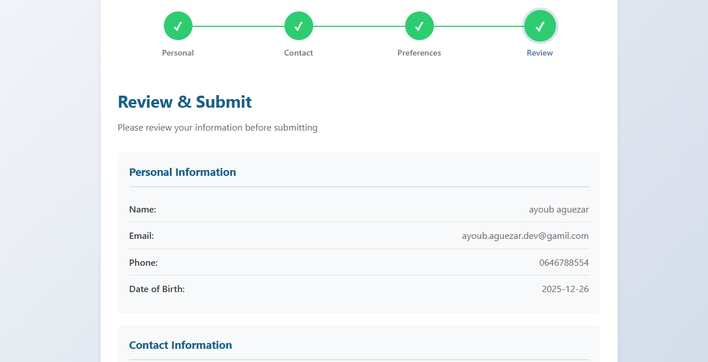
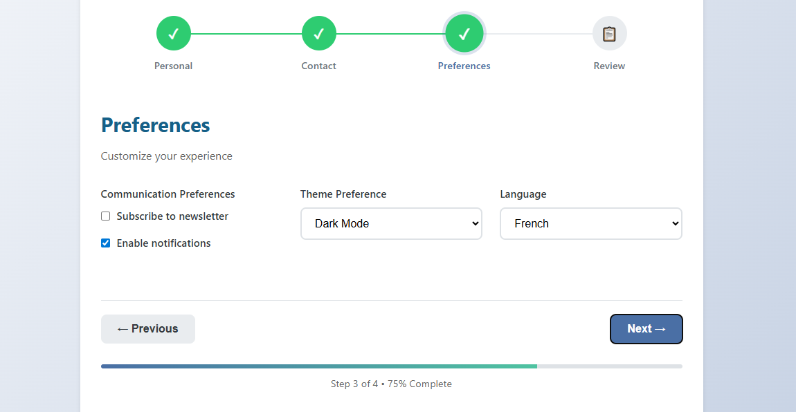

<p align="center">
  
</p>


# Responsive React Form Application

A modern, multi-step form application built with React featuring responsive design, real-time validation, and a clean user interface.


---

<p align="center">
  
</p>
<p align="center">
  
</p>


--- 
## ✨ Features

- 📱 Fully responsive (mobile, tablet, desktop)
- 🔄 Multi-step form with progress indicator
- ✅ Real-time form validation
- 🎨 Clean and modern UI/UX
- 💾 Data persistence between steps
- 🚀 Ready for API integration

---

## 🛠️ Installation Guide

### ✅ Prerequisites

- Node.js (v14 or higher)
- npm or yarn

Check versions:
```bash
node -v
npm -v
```

---

### 📥 Clone the Repository

```bash
git clone https://github.com/Ayoub-glitsh/react-form-app.git
cd react-form-app
```

---

### 📦 Install Dependencies

```bash
npm install
# or
yarn install
```

---

### ▶️ Run the Application

```bash
npm start
# or
yarn start
```

Open your browser and visit:
http://localhost:3000

---

## 📁 Project Structure

```
react-form-app/
├── public/
├── src/
│   ├── components/
│   │   ├── ResponsiveForm.js
│   │   ├── FormStepIndicator.js
│   │   ├── Button.js
│   │   └── form-steps/
│   ├── App.js
│   ├── App.css
│   └── index.js
├── package.json
├── README.md
└── .gitignore
```

---

## 🚀 Build for Production

```bash
npm run build
```

---
## 🧰 Technology Stack

### 📝 Languages


---

### ⚛️ Frameworks & Libraries


---

### 🎨 Styling & Layout


---

### 🛠️ Tools & Tooling


---

### 🌐 Web Standards & APIs


---

### 🧠 Design Patterns & Principles


---

> 🚀 **50+ technologies, tools, and best practices used**

---

## 🤝 Contributing

1. Fork the repository
2. Create a branch: `git checkout -b feature/new-feature`
3. Commit changes
4. Push and open a Pull Request

---

## 📝 License

This project is licensed under the MIT License.

---

⭐ Made with by Ayoub Aguezar

--- 


<p align="center">
  
</p>

